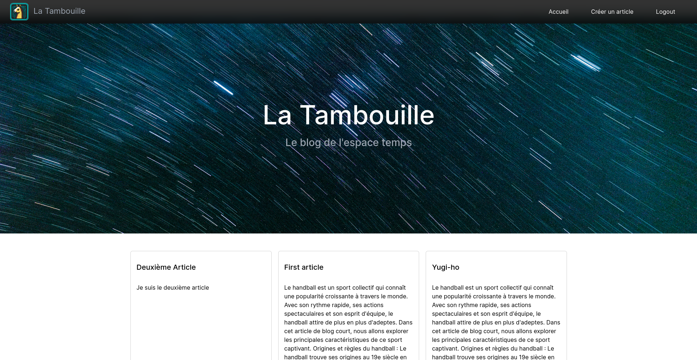
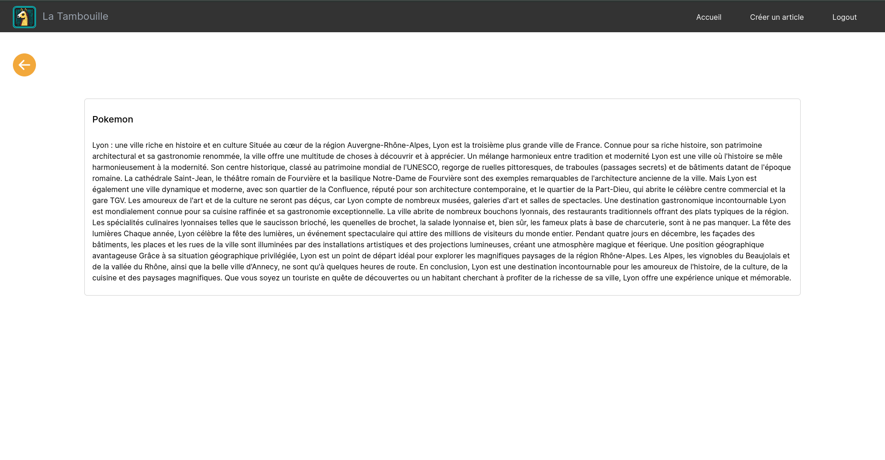

# Présentation

Le site de la `Tambouille` permet de créer divers blogs générer par l'IA ChatGPT.

L'administrateur peut créer des articles, les modifier, les supprimer et les publier.

Les visiteurs peuvent consulter les articles publiés.





# Mise en route de l'application

## Installation

Il suffit de d'exécuter les commandes suivantes dans le dossier `frontend` et le dossier `backend` :

```
npm i && npm run build
```

## Lancement

L'API backend se lance avec la commande `npm run start`

Pour lancer l'application frontend, il faut executer la commande `npm run preview`.

Les deux applications sont consultables à l'adresse localhost. L'interface sur le port `4173` et l'api sur le port `3000` (par défaut, modifiable dans le fichier .env).

## Tests

Pour lancer les tests du l'API, il faut se rendre dans le dossier `back` et lancer la commande `npm run test` pour lancer les tests unitaires et d'intégration.

# Architecture

## Global

L'API étant basé sur Express, le choix d'architecture est assez libre, elle s'apparente à un MVC, avec l'implémentation de middleware pour les exceptions et la sécurisation par JWT.

Puisque l'API est orienté REST, les couples controller / service sont répartis dans le dossier `resources`. Ainsi un couple s'occupe d'une ressource en particulier (exception pour security qui n'est pas une ressource, mais utilise un utilisateur).

Dans le dossier `types`, on retrouve les classes permettant de typer et structurer l'application.

Pour la gestion des données et la gestion des erreurs, les services se trouvent dans le dossier `utils`.

Le dossier `data` contient les données mock de l'application.

## Logicielle

Le fichier `index.ts` permet d'initialiser l'application, en se basant sur un fichier `.env` (notamment pour le port).

```ts
/**
 * CRUD for articles handled by '/articles'
 */
app.use("/articles", ArticlesController);
```

Ici on définit un endpoint de notre application, en faisant le lien entre la route `/articles` et le controller `ArticlesController`.

Dans le controller on retrouvera une méthode associée à un suffixe de la route (par exemple en rajoutant `/:id`), qui correspond à une méthode HTTP permettant de réaliser des actions sur une ressource.
Concrètement, GET, POST, PUT, DELETE. PATCH étant un peu plus technique à mettre en place pour le mock nous ne l'avons pas implémenté.

Le controller demande à son service de réaliser les actions qui lui sont demandées et renvoie les erreurs qu'il interpelle.

Un service prend en paramètre de son constructeur une interface [Ireaderwriter](backend/src/types/ireaderwriter.ts) offrant des actions sur diverses ressources (peu importe laquelle).

Cette interface a pour but d'implémenter plus facilement un mock ou une bdd en l'implémentant dans des gestionnaires de données (cf. dossier `utils`).

Pour cela on pourra se baser sur une variable dans le fichier `.env`. Pour la génération des contenus d'article, on se base sur le même principe.

En effet, nous avons rencontré des soucis pour utiliser OpenAi (aucun compte disponible avec des requêtes disponibles gratuites et impossibilité de créer un nouveau compte avec nos numéros de téléphone déjà utilisés).
Nous avons donc créé un jeu de données dans un fichier `articlesContents.json` et nous en piochant un au hasard dedans (sans tenir compte du titre). C'est un peu moins réaliste pour une démo.

# Structure du Mock

## Articles

Utilisation d'un fichier "articles.json" plutôt que plusieurs fichiers.
Le risque d'avoir beaucoup d'articles, entraine beaucoup de fichiers peut rendre le projet lourd et la pagination un peu faramineuse. Le mieux serait une base de données, par soucis de temps et de contraintes, nous resterons sur un principe de fichier.

Dans ce fichier "articles.json", on retrouvera un tableau contenant nos articles sous cette forme :

```json
{
  "id": 1651654321,
  "title": "Les blogs pour les nuls",
  "content": "Voici un article généré par ChatGPT sur les blogs",
  "isPublished": false,
  "dateCreated": 11123556,
  "datePublished": 11123556
}
```

Pour anticiper l'évolutivité et intégrer des catégories, nous imaginons rajouter un champ `idCategory` équivalent à `null` par défaut. Le modèle d'une catégorie ressemble à cela :

```json
{
  "id": 123,
  "name": "Sport"
}
```

## Authentification

L'admin est la seule personne à pouvoir se connecter, puisque c'est la seule à pouvoir créer des articles (c'est son blog). De ce fait, la route pour obtenir un JWT est "utilisée" uniquement par l'admin (et sécurisée par ses identifiants).
L'admin sera stocké dans le fichier ".env" (non commité) comme suit :

```txt
ADMIN_LOGIN=admin
ADMIN_PASSWORD=admin
```

Au niveau du middleware d'authentification, il faudra prendre en compte l'environnement (prod ou dev) dans lequel on est pour aller chercher l'utilisateur dans le fichier .env ou en base (et mettre en place un encryptage).

# Gitflow

On a une branche `master` qui correspond au code livré en prod.
On a une branche `dev` qui correspond à la preprod, et où on merge les features et fix.
Les branches features se nomment `feat/nom_feature`, et les branches fix `fix/nom_fix`.

Dès qu'on a fini le dev lié à la branche, on crée un Pull Request (PR) sur Github, et une fois qu'on la résout, on supprime la branche.

Nous essayons de respecter la structure suivante pour les commits :

```
[ACTION] - endroit

Message indiquant ce qui a était fait
```

Parmi les actions, on retrouve ADD, EDIT ou DEL et les endroits sont Back ou Front. Cela permet de mieux comprendre pour quelle partie de l'application.

# Mésaventure avec ChatGPT

Nous avons tenté d'accéder à OpenAI en utilisant une clef d'API de plusieurs comptes différents, mais chaque appel nous retourne une erreur 429.
L'erreur indique que nous ne pouvons plus faire de requêtes gratuitement avec ce compte. Étrangement, sur trois comptes que nous avons essayés, les trois nous on retournait la même erreur.

Après investigation, nous avons découvert que les crédits pour effectuer des requêtes sont accordés pour une durée limitée.
Puisque nos comptes ont été créés il y a un moment, nous n'avons plus de crédit utilisable.

On a donc décidé de mocker, comme expliqué plus haut.

# Liste des technos et leur version

- Mocha `v10.2.0` : framework de test JavaScript utilisé pour exécuter des tests unitaires et d'intégration. Dans notre cas d'utilisation, il nous permet d'exécuter les tests du fichier article.test.ts

- Supertest `v6.3.3` : bibliothèque qui permet de simuler des requêtes HTTP et de vérifier leurs réponses. Une fois qu'on a connaissance de la réponse, on utilise le package suivant pour réaliser les assertions.

- Chai `v4.3.7` : bibliothèque d'assertions qui permet de vérifier les résultats attendus. Dans notre cas, elle permet de vérifier qu'on obtient le bon statut code (expect) et que la valeur retournée est bien la bonne (assert).

- VueJS `v3.3.4` : framework JavaScript open-source utilisé pour construire des interfaces utilisateur et des applications web monopages.

- Vite `v4.3.9` : outil de build ultra-rapide pour le développement web moderne. Il est utilisé pour le développement de l'application VueJS.

- Axios `v1.4.0` : bibliothèque permettant de faire des requêtes HTTP depuis le navigateur et Node.Js.

- Bootstrap `v5` : framework CSS open-source qui contient des outils pour créer des sites et des applications web.

- Express `v4.18.2` : Express est une infrastructure d'applications Web Node.js minimaliste et flexible qui fournit un ensemble de fonctionnalités robuste pour les applications Web et mobiles.

- Jsonwebtoken `v9.0.0` : bibliothèque permettant de générer des JWT et d'assurer une vérification dans le header des requêtes reçue par le serveur (via middleware avec Express).

- Openai `v3.3.0` : bibliothèque permettant la communication avec OpenAI API depuis Node.Js.

# Fichier .env

Voici à quoi doit ressembler votre fichier .env :

```
API_PORT=3000
ACCESS_TOKEN_SECRET=
REFRESH_TOKEN_SECRET=
ADMIN_LOGIN=
ADMIN_PASSWORD=
API_KEY_OPENAI=
```

Vous êtes libres de mettre les valeurs que vous souhaitez. Pour rappel, si vous avez une clef d'api d'un compte OpenAi qui vous permet d'effectuer des requêtes, vous pouvez renseigner la clef `API_KEY_OPENAI`.
Autrement laissez la vide pour utiliser le mock, attention la clef **doit** exister tout de même !

# CI/CD

## CI
Pendant les etapes de l'intégration continue voici les commandes qui sont exécuté
<br/>
<br/>

**Back**
- ```npm install && npm run build```

**Front**
- ```npm install && npm run build```

**A la Racine**
- ```npm i && npm run lintBack && npm run lintFront```


## CD
Le livrable fournit est une archive


## Deploiment Continue

Pour créer un nouveau déploiement, il faut créer un nouveau tag avec le nom de version